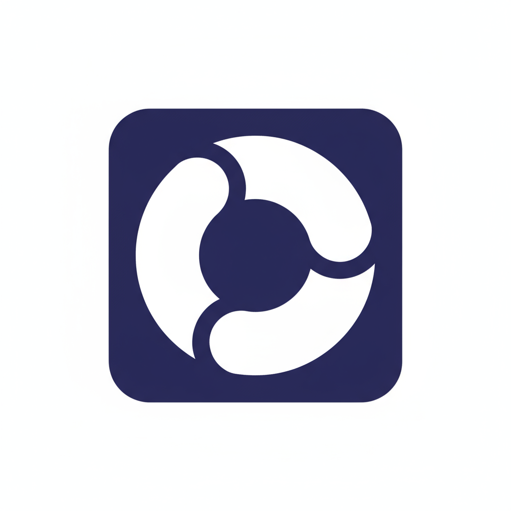
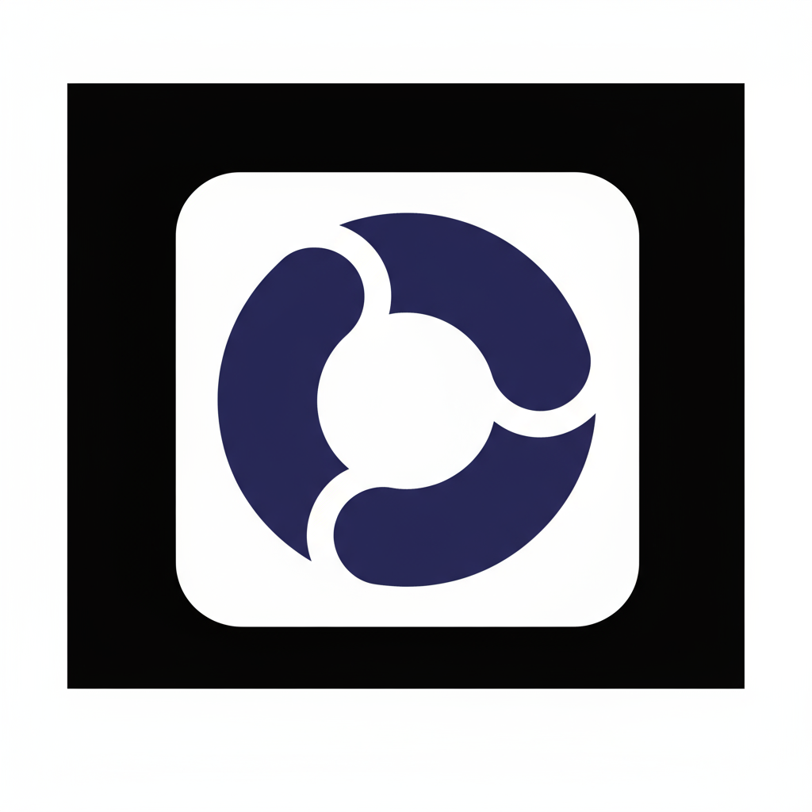

# Get It Done! Brand Style Guide

**Version 1.0 | October 2025**

---

## Table of Contents

1. [Brand Overview](#brand-overview)
2. [Logo Usage](#logo-usage)
3. [Color Palette](#color-palette)
4. [Typography](#typography)
5. [Voice & Tone](#voice--tone)
6. [Imagery & Photography](#imagery--photography)
7. [UI Components](#ui-components)
8. [Application Examples](#application-examples)

---

## Brand Overview

### Brand Essence

**Get It Done!** is a holistic productivity motivation app that adapts to every stage of life—from student to professional to parent. We combine task management with personalized motivation to help people accomplish what matters most.

### Brand Promise

*"Motivation for every stage of life"*

### Brand Personality

- **Supportive** - We're your ally, not your critic
- **Adaptive** - We meet you where you are
- **Intelligent** - We learn what works for you
- **Energetic** - We inspire action, not guilt
- **Inclusive** - We serve everyone, including neurodivergent users

### Target Audience

- **Primary:** Ages 24-55 (Millennials & Gen X)
- **Segments:** University students, professionals, working parents, teams
- **Psychographics:** Achievement-oriented, overwhelmed, seeking support

---

## Logo Usage

### Primary Logo



**Deep indigo rounded square badge with white continuous cycle symbol**

**Use for:**
- Light backgrounds
- App icon (iOS, Android, web)
- Marketing materials
- Website header
- Social media profile images
- App store listings

**Minimum size:** 32px × 32px (digital) | 0.5 inches (print)

### Reverse Logo



**White rounded square badge with deep indigo continuous cycle symbol**

**Use for:**
- Dark backgrounds
- Dark mode interfaces
- Presentations on dark slides
- Video overlays
- Dark-themed marketing materials

**Minimum size:** 32px × 32px (digital) | 0.5 inches (print)

### Logo Symbolism

The **continuous cycle with three connected segments** represents:

1. **Life Stages** - Student → Professional → Parent (and continuous evolution)
2. **Continuous Progress** - Tasks flow into completion, completion flows into new tasks
3. **Holistic Approach** - All aspects of life connected and supported
4. **Momentum** - The curved segments suggest forward motion and energy

### Clear Space

Maintain clear space around the logo equal to **25% of the logo's height** on all sides.

```
┌─────────────────────────┐
│         25%             │
│   ┌─────────────┐       │
│   │             │       │
│25%│    LOGO     │  25%  │
│   │             │       │
│   └─────────────┘       │
│         25%             │
└─────────────────────────┘
```

### Logo Don'ts

❌ **DO NOT:**
- Change the logo colors
- Rotate or skew the logo
- Add effects (drop shadows, gradients, glows)
- Place logo on busy backgrounds
- Stretch or distort proportions
- Use low-resolution versions
- Recreate or modify the symbol

---

## Color Palette

### Primary Colors

#### Deep Indigo (Brand Primary)
- **Hex:** `#3B4A6B`
- **RGB:** 59, 74, 107
- **CMYK:** 72, 61, 30, 22
- **Pantone:** 19-4027 TCX (Mood Indigo)

**Usage:** Logo, primary buttons, headers, key UI elements

**Psychology:** Sophisticated, trustworthy, modern (appeals to 24-55 demographic)

#### Pure White
- **Hex:** `#FFFFFF`
- **RGB:** 255, 255, 255
- **CMYK:** 0, 0, 0, 0

**Usage:** Backgrounds, logo symbol, text on dark backgrounds

### Secondary Colors

#### Energetic Teal
- **Hex:** `#14B8A6`
- **RGB:** 20, 184, 166
- **CMYK:** 73, 0, 43, 0
- **Pantone:** 3262 C

**Usage:** Accent color, success states, positive motivation messages, student segment

**Psychology:** Energetic, fresh, appeals to both Gen X and Millennials

#### Warm Orange
- **Hex:** `#F97316`
- **RGB:** 249, 115, 22
- **CMYK:** 0, 62, 95, 0
- **Pantone:** 1585 C

**Usage:** Call-to-action buttons, alerts, cheeky motivation messages, parent segment

**Psychology:** Motivation, energy, action-oriented

#### Forest Green
- **Hex:** `#22C55E`
- **RGB:** 34, 197, 94
- **CMYK:** 68, 0, 85, 0
- **Pantone:** 2270 C

**Usage:** Success indicators, completed tasks, professional segment

**Psychology:** Growth, achievement, organic

### Neutral Colors

#### Slate Gray (Dark)
- **Hex:** `#1E293B`
- **RGB:** 30, 41, 59
- **Usage:** Body text, dark mode backgrounds

#### Medium Gray
- **Hex:** `#64748B`
- **RGB:** 100, 116, 139
- **Usage:** Secondary text, borders, disabled states

#### Light Gray
- **Hex:** `#F1F5F9`
- **RGB:** 241, 245, 249
- **Usage:** Backgrounds, cards, subtle dividers

### Color Usage by Segment

**Students:** Deep Indigo + Energetic Teal  
**Professionals:** Deep Indigo + Forest Green  
**Parents:** Deep Indigo + Warm Orange  
**Teams:** Deep Indigo + Forest Green  
**Autism-Friendly:** Deep Indigo + Neutral Grays (reduced color complexity)

### Accessibility

All color combinations meet **WCAG 2.1 AA standards** for contrast:

- Deep Indigo on White: **8.5:1** ✅
- White on Deep Indigo: **8.5:1** ✅
- Energetic Teal on White: **3.2:1** ✅
- Warm Orange on White: **3.1:1** ✅

---

## Typography

### Primary Typeface: Inter

**Inter** is a modern, highly legible sans-serif font optimized for digital interfaces.

#### Headings
- **Font:** Inter Bold (700)
- **Sizes:** 
  - H1: 36px / 2.25rem
  - H2: 30px / 1.875rem
  - H3: 24px / 1.5rem
  - H4: 20px / 1.25rem

#### Body Text
- **Font:** Inter Regular (400)
- **Size:** 16px / 1rem
- **Line Height:** 1.5 (24px)
- **Color:** Slate Gray (#1E293B)

#### UI Elements
- **Font:** Inter Medium (500)
- **Size:** 14px / 0.875rem
- **Usage:** Buttons, labels, navigation

#### Small Text
- **Font:** Inter Regular (400)
- **Size:** 14px / 0.875rem
- **Usage:** Captions, helper text, timestamps

### Fallback Fonts

```css
font-family: 'Inter', -apple-system, BlinkMacSystemFont, 'Segoe UI', 
             'Roboto', 'Oxygen', 'Ubuntu', 'Cantarell', sans-serif;
```

### Typography Don'ts

❌ **DO NOT:**
- Use more than 2 font weights in a single view
- Use all caps for body text
- Use font sizes smaller than 14px
- Use decorative or script fonts
- Use justified text alignment

---

## Voice & Tone

### Brand Voice

Our voice is **supportive, intelligent, and energetic**—like a witty friend who genuinely wants you to succeed.

#### Voice Attributes

**Supportive (Not Preachy)**
- ✅ "You've got this. Let's tackle that task together."
- ❌ "You should really get started on that task."

**Intelligent (Not Condescending)**
- ✅ "Based on your pattern, mornings work best for you."
- ❌ "Obviously, you're a morning person."

**Energetic (Not Aggressive)**
- ✅ "Time to make today count! What's first?"
- ❌ "Get up and do something already!"

**Playful (Not Unprofessional)**
- ✅ "Netflix will still be there later. Promise."
- ❌ "Stop being lazy and get off the couch."

### Tone by Motivation Style

#### Positive Stream
- Encouraging, warm, celebratory
- "Great work! You're on a 7-day streak!"
- "You're making amazing progress this week."

#### Cheeky Stream
- Witty, self-aware, gently provocative
- "Your couch called. It said you're spending too much time together."
- "That task isn't going anywhere. Unlike your motivation if you wait too long."

#### Autism-Friendly Stream
- Literal, clear, predictable
- "Your meeting starts in 15 minutes. You have time to prepare."
- "You completed 7 tasks this week. Well done."

### Writing Guidelines

**DO:**
- Use contractions (you're, let's, it's)
- Address the user directly (you, your)
- Be specific with time ("15 minutes" not "soon")
- Celebrate small wins
- Use humor that respects intelligence

**DON'T:**
- Use guilt or shame
- Make assumptions about user's situation
- Use corporate jargon
- Over-explain or patronize
- Use sarcasm in autism-friendly mode

---

## Imagery & Photography

### Photography Style

**Authentic, diverse, action-oriented**

#### Subject Matter
- Real people (not stock photo models)
- Diverse ages, ethnicities, abilities
- Everyday moments (studying, working, parenting)
- Action shots (not posed portraits)
- Natural lighting (not overly processed)

#### Mood
- Energetic but not frantic
- Focused but not stressed
- Accomplished but not boastful
- Supportive but not sentimental

### Image Treatment

- **Aspect Ratios:** 16:9 (web), 1:1 (social), 9:16 (mobile)
- **Filters:** Minimal - slight warmth, increased contrast
- **Overlays:** Deep indigo overlay at 40% opacity for text readability

### Illustration Style

- **Type:** Flat, geometric, modern
- **Colors:** Brand palette only
- **Usage:** Icons, empty states, onboarding

---

## UI Components

### Buttons

#### Primary Button
```css
background: #3B4A6B (Deep Indigo)
color: #FFFFFF (White)
border-radius: 8px
padding: 12px 24px
font: Inter Medium 16px
```

**Hover:** Lighten background by 10%  
**Active:** Darken background by 10%

#### Secondary Button
```css
background: transparent
color: #3B4A6B (Deep Indigo)
border: 2px solid #3B4A6B
border-radius: 8px
padding: 12px 24px
font: Inter Medium 16px
```

#### CTA Button (Call-to-Action)
```css
background: #F97316 (Warm Orange)
color: #FFFFFF (White)
border-radius: 8px
padding: 12px 24px
font: Inter Medium 16px
```

### Cards

```css
background: #FFFFFF (White)
border: 1px solid #E2E8F0
border-radius: 12px
padding: 24px
box-shadow: 0 1px 3px rgba(0,0,0,0.1)
```

### Input Fields

```css
background: #FFFFFF (White)
border: 1px solid #CBD5E1
border-radius: 8px
padding: 12px 16px
font: Inter Regular 16px
color: #1E293B (Slate Gray)
```

**Focus:** Border color changes to Deep Indigo (#3B4A6B)

### Badges/Tags

```css
background: #F1F5F9 (Light Gray)
color: #64748B (Medium Gray)
border-radius: 16px
padding: 4px 12px
font: Inter Medium 12px
```

**Segment Colors:**
- Student: Energetic Teal background
- Professional: Forest Green background
- Parent: Warm Orange background

---

## Application Examples

### App Icon

- Use **Primary Logo** (deep indigo badge, white symbol)
- Export at required sizes: 1024×1024, 512×512, 192×192, 180×180, 120×120, 76×76
- Include 5% padding inside icon boundaries

### Website Header

```
┌────────────────────────────────────────┐
│ [Logo] Get It Done!    Home  Features  │
│                        Pricing  Login   │
└────────────────────────────────────────┘
```

- Logo: 40px height
- Background: White
- Text: Deep Indigo
- Spacing: 16px between elements

### Social Media

#### Profile Image
- Use Primary Logo
- Minimum 400×400px
- Center logo with 10% padding

#### Cover Image (Facebook, LinkedIn)
- Background: Deep Indigo
- Logo: Reverse (white badge)
- Tagline: "Motivation for every stage of life" in white
- Dimensions: 1200×630px

#### Instagram Posts
- Aspect ratio: 1:1 (1080×1080px)
- Brand colors as backgrounds
- Logo in corner (100px)
- Typography: Inter Bold for headlines

### Email Signature

```
[Name]
[Title]
Get It Done!

[Logo - 60px height]

www.getitdone.app
```

---

## Brand Guidelines Summary

### Always Remember

1. **Consistency is key** - Use approved logos, colors, and fonts
2. **Accessibility matters** - Ensure readability and contrast
3. **Voice reflects values** - Supportive, not judgmental
4. **Imagery shows diversity** - Represent all our users
5. **Simplicity wins** - Clean, uncluttered design

### Questions?

For brand guideline questions or asset requests, contact:  
**brand@getitdone.app**

---

**Document Version:** 1.0  
**Last Updated:** October 2025  
**Next Review:** January 2026

